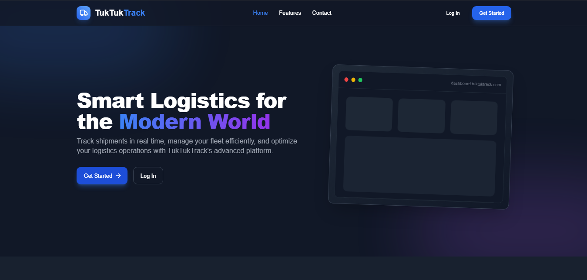
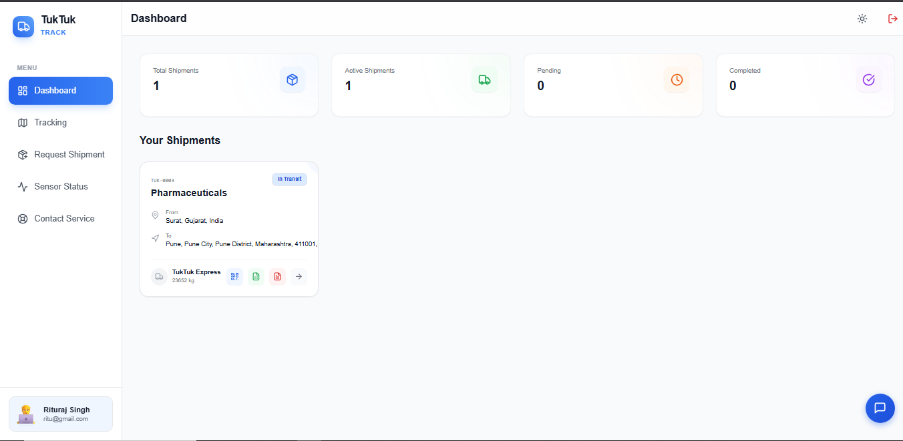
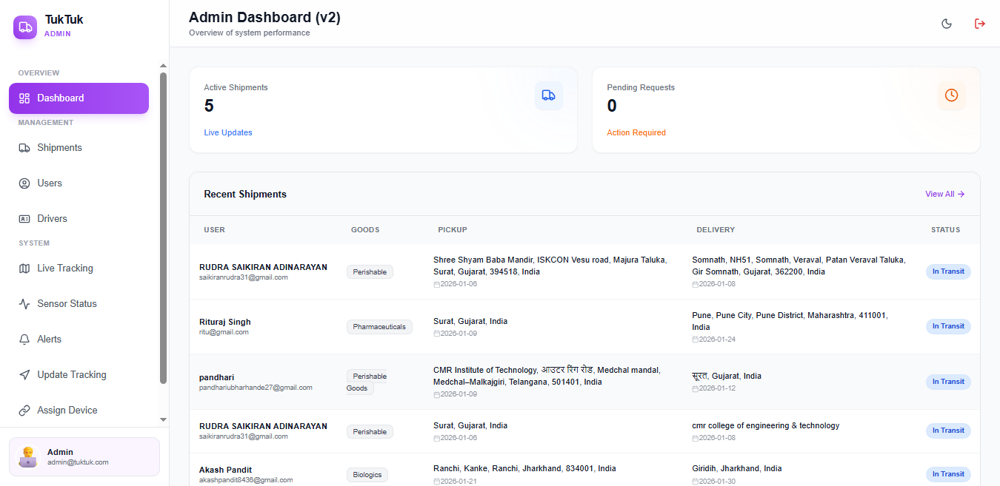

<p align="center">
  
  
  
  
</p>

# 🚚 TukTukTrack - Next Gen Logistics

> A comprehensive, real-time logistics and fleet management platform designed to revolutionize how shipments are tracked, managed, and delivered.

TukTukTrack is a smart logistics platform that connects **Administrators**, **Drivers**, and **Customers** through a unified, intuitive interface. With advanced GPS integration, real-time monitoring, and powerful analytics, it streamlines operations for businesses handling sensitive and time-critical deliveries.

---

## 📸 Screenshots

<!-- Add your screenshots here -->
| Landing Page | User Dashboard | Admin Panel |
|:---:|:---:|:---:|
|  |  |  |

> 💡 *Add screenshots to a `screenshots/` folder in your project root*

---

## ✨ Features

### 🗺️ Real-time Tracking
- Live GPS tracking with interactive maps
- Real-time location updates for shipments
- Route visualization and ETA calculations
- Geofencing alerts for delivery zones

### 👥 Role-Based Access Control
| Role | Capabilities |
|------|-------------|
| **Admin** | Manage users, drivers, shipments, assign devices, view analytics, configure alerts |
| **Driver** | View assigned shipments, update delivery status, sensor monitoring, contact support |
| **User** | Request shipments, track packages in real-time, view history, manage profile |

### 📊 Analytics & Reports
- Performance metrics and KPIs
- Cost analysis and optimization insights
- Delivery success rate tracking
- Exportable reports (PDF/CSV)

### 🌡️ Cold Chain Monitoring
- Real-time temperature and humidity tracking
- Shock detection and tilt alerts (MPU-6050 sensor)
- Configurable threshold alerts
- Sensor status dashboards

### 🤖 AI-Powered Chatbot
- Integrated customer support chatbot
- Quick answers to common queries
- Seamless escalation to human support

### 🔒 Security Features
- Firebase Authentication with role-based access
- Admin approval workflow for new registrations
- Secure data encryption
- Session management and guards

### 📱 Progressive Web App (PWA)
- Mobile-first responsive design
- Installable on devices
- Offline capabilities

---

## 🛠️ Tech Stack

| Category | Technology |
|----------|------------|
| **Frontend** | HTML5, JavaScript (ES6+), CSS3 |
| **Styling** | Tailwind CSS v3.4 |
| **Icons** | Lucide Icons |
| **Backend** | Firebase (Authentication, Firestore, Realtime Database) |
| **Maps** | Leaflet.js / Google Maps API |
| **Build Tools** | Node.js, npm, PostCSS, Autoprefixer |

---

## 📂 Project Structure

```
tuk-tuk-track/
├── index.html                  # Landing page
├── login.html                  # User login
├── register.html               # User registration
├── admin-login.html            # Admin login
├── init-admin.html             # Initialize admin account
│
├── dashboard.html              # User dashboard
├── driver-dashboard.html       # Driver dashboard
├── admindashboard.html         # Admin control panel
│
├── admin-*.html                # Admin management pages
│   ├── admin-users.html        # User management
│   ├── admin-drivers.html      # Driver management
│   ├── admin-shipments.html    # Shipment management
│   ├── admin-tracking.html     # Shipment tracking
│   ├── admin-alerts.html       # Alert configuration
│   └── admin-assign-device.html# Device assignment
│
├── track.html                  # Public tracking page
├── request.html                # Shipment request form
├── profile.html                # User profile
├── alerts.html                 # User alerts
├── sensor-status.html          # Sensor monitoring
│
├── contact-service-*.html      # Role-specific contact pages
│
├── js/                         # JavaScript modules
│   ├── auth.js                 # Authentication logic
│   ├── admin-auth.js           # Admin authentication
│   ├── auth-ui.js              # Auth UI helpers
│   ├── main.js                 # Core application logic
│   ├── chatbot.js              # AI chatbot integration
│   ├── sensor-status.js        # Sensor data handling
│   └── contact-service-*.js    # Contact service logic
│
├── css/                        # Compiled stylesheets
│   └── style.css               # Tailwind output
│
├── src/                        # Source files
│   └── input.css               # Tailwind input
│
├── firebase-config.js          # Firebase configuration
├── firestore.rules             # Firestore security rules
├── database.rules.json         # Realtime DB rules
├── tailwind.config.js          # Tailwind configuration
└── package.json                # Node dependencies
```

---

## ⚙️ Getting Started

### Prerequisites

- **Node.js** v16+ and **npm** installed
- **Firebase** project configured
- **Git** for version control
- Code editor (VS Code recommended)

### Installation

1. **Clone the repository:**
   ```bash
   git clone https://github.com/your-username/tuk-tuk-track.git
   cd tuk-tuk-track
   ```

2. **Install dependencies:**
   ```bash
   npm install
   ```

3. **Configure Firebase:**
   - Create a Firebase project at [Firebase Console](https://console.firebase.google.com)
   - Enable Authentication (Email/Password)
   - Enable Firestore Database
   - Enable Realtime Database
   - Copy your config to `firebase-config.js`:
     ```javascript
     const firebaseConfig = {
       apiKey: "YOUR_API_KEY",
       authDomain: "YOUR_PROJECT.firebaseapp.com",
       databaseURL: "https://YOUR_PROJECT.firebaseio.com",
       projectId: "YOUR_PROJECT_ID",
       storageBucket: "YOUR_PROJECT.appspot.com",
       messagingSenderId: "YOUR_SENDER_ID",
       appId: "YOUR_APP_ID"
     };
     ```

4. **Start development server:**
   ```bash
   npm run build
   ```
   > This runs Tailwind CSS in watch mode: `tailwindcss -i ./src/input.css -o ./css/style.css --watch`

5. **Open in browser:**
   - Use VS Code **Live Server** extension, or
   - Open `index.html` directly in your browser

---

## 🚀 Deployment

### Option 1: Firebase Hosting (Recommended)

1. **Install Firebase CLI:**
   ```bash
   npm install -g firebase-tools
   ```

2. **Login to Firebase:**
   ```bash
   firebase login
   ```

3. **Initialize hosting:**
   ```bash
   firebase init hosting
   ```
   - Select your Firebase project
   - Set public directory to `.` (current directory)
   - Configure as single-page app: **No**

4. **Build production CSS:**
   ```bash
   npx tailwindcss -i ./src/input.css -o ./css/style.css --minify
   ```

5. **Deploy:**
   ```bash
   firebase deploy --only hosting
   ```

### Option 2: Netlify

1. Connect your GitHub repository to [Netlify](https://netlify.com)
2. Set build command: `npx tailwindcss -i ./src/input.css -o ./css/style.css --minify`
3. Set publish directory: `.`
4. Deploy!

### Option 3: Vercel

1. Import your project to [Vercel](https://vercel.com)
2. Configure build settings similar to Netlify
3. Deploy with one click

### Option 4: GitHub Pages

1. Build production CSS locally
2. Push to `main` or `gh-pages` branch
3. Enable GitHub Pages in repository settings

---

## 🔧 Environment Configuration

Create a `.env` file (if using environment variables):

```env
FIREBASE_API_KEY=your_api_key
FIREBASE_AUTH_DOMAIN=your_project.firebaseapp.com
FIREBASE_PROJECT_ID=your_project_id
```

---

## 🧪 Testing

- **Manual Testing:** Open in browser and test all user flows
- **Cross-Browser:** Test on Chrome, Firefox, Safari, Edge
- **Mobile Testing:** Use device emulation or real devices
- **Lighthouse Audit:** Run via Chrome DevTools for performance metrics

---

## 👥 Contributors

<table>
  <tr>
    <td align="center">
      <a href="https://github.com/your-username">
        <br />
        <sub><b>Your Name</b></sub>
      </a><br />
      <sub>Lead Developer</sub>
    </td>
    <!-- Add more contributors as needed -->
  </tr>
</table>

> 💡 *Update the contributors section with actual team members*

---

## 🤝 Contributing

Contributions are welcome! Please follow these steps:

1. Fork the repository
2. Create a feature branch: `git checkout -b feature/amazing-feature`
3. Commit changes: `git commit -m 'Add amazing feature'`
4. Push to branch: `git push origin feature/amazing-feature`
5. Open a Pull Request

---

## 📝 License

This project is licensed under the **ISC License** - see the [LICENSE](LICENSE) file for details.

---

## 📞 Support

- 📧 Email: support@tuktuktrack.com
- 🐛 Issues: [GitHub Issues](https://github.com/your-username/tuk-tuk-track/issues)
- 💬 Discussions: [GitHub Discussions](https://github.com/your-username/tuk-tuk-track/discussions)

---

<p align="center">
  Made with ❤️ by the TukTukTrack Team<br>
  © 2026 TukTukTrack™. All Rights Reserved.
</p>
